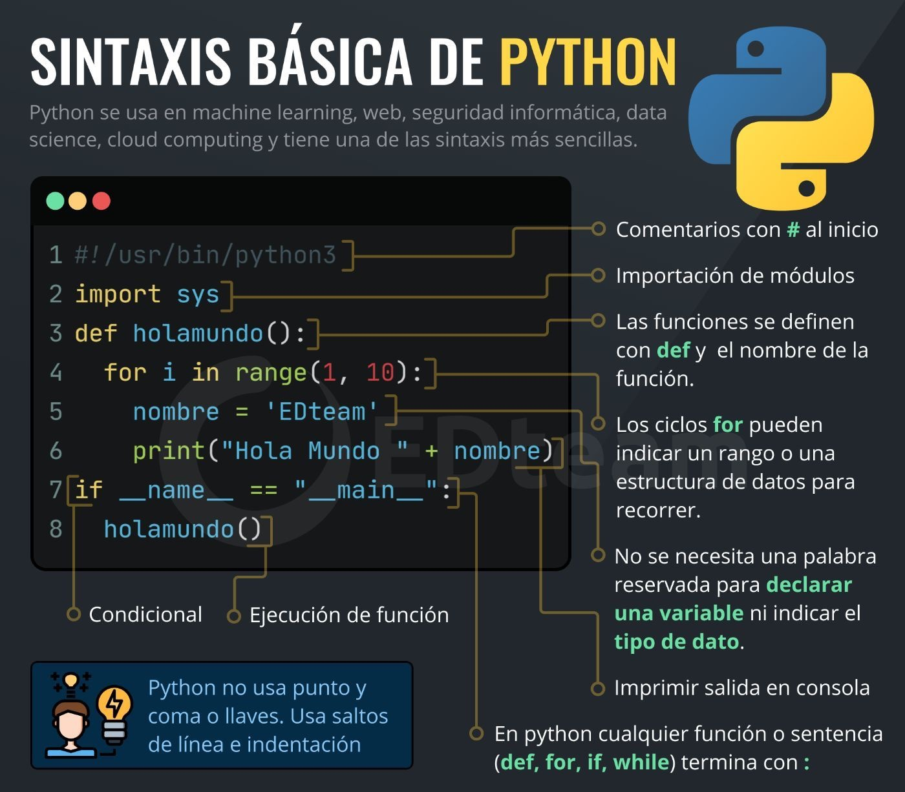

# Intro

## ¿Qué es programación?

* Es el proceso de **codificar un algoritmo** en un lenguaje de programación
* Es una habilidad que se adquiere mejor con la **práctica** y el **ejemplo** más que con los libros (Alan Turing)

  

## ¿Cuáles son las ramas de la programación?

* Desarrollo Web
* Desarrollo Movil
* Videojuegos
* Seguridad Informática
* Inteligencia Artificial
* Ciencia de Datos

## ¿Qué es un algoritmo?

* Es la secuencia de pasos que resuelven un problema
* Debe ser preciso, finito y legible
* Partes:

  |                |                           |
  | --             | --                        |
  | **1. Entrada** | datos                     |
  | **2. Proceso** | operaciones con los datos |
  | **3. Salida**  | resultado                 |

  

## ¿Cómo se resuelve un problema?

1. **Diseñar** un algoritmo para el problema
1. Expresar el algoritmo como un **Programa** (especificación formal de un algoritmo por medio de un lenguaje de programación)
1. **Ejecutar** el programa (Eficiencia + V&V)

    

## ¿Qué es un lenguaje de programación?

* Es una notación para escribir programas
* Proporcionan estructuras:

  |                 |                             |
  | --              | --                          |
  | **sintácticas** | cómo escribir una expresión |
  | **semánticas**  | cómo evaluar una expresión  |

## Genealogía de los lenguajes de programación


* A partir de los ‘90 proliferan con gran éxito la tecnología y LOO
* Los más implantados en la actualidad: Java, Python, C++, C#, ...

## Python

* Es un lenguaje de programación popular (simple: claro, legible y breve)
* Interpretado
* Multipropósito: app web, data science, ...
* Multiplataforma: win, mac, linux, ...
* Multiparadigma: procedimental, oo, funcional

## Instalación

* Comprobar instalación

  ```sh
  python --version
  ```

* [Sitio web para descarga gratuita](https://www.python.org/)

## Aprender con ejemplos

* Escribir archivo python en un editor: hola.py

  ```py
  print('Hola mundo!')
  ```

* Ejecutar

  ```sh
  python hola.py
  ```

## Aprender pensando en los TESTS

* TDD: Test Driven Development
* Es un enfoque de programación que se utiliza durante el desarrollo de software en el que se realizan pruebas unitarias antes de escribir el código
* Permite obtener programas de mayor calidad donde todo queda probado


* Usamos **unittest**: libreria de test unitario que viene por defecto con Python.
* Generan assertions, nos va a decir si la prueba PASÓ o FALLÓ
  * PASÓ: **.**
  * FALLÓ. **F**
* Si todos los test pasaron entonces muestra **OK** caso contrario AssertionError por cada test que ha fallado

## Ejemplo Medidas Resumen

[Medidas Resumen](../proy/01_medidas_resumen.py)

## Sintaxis básica Python



* **comentarios**: documentación dentro del código

  ```py
    # Esto es un comentario unilínea

    """
    Esto es un comentario
      multilínea
    """
    ```

* **sangria**: indica bloque de código

  ```py
  if 5 > 2:
      print('5 es mayor que 2')
  ```

* **variables**: almacenan valores y se crean cuando se les asigna un valor. Se infiere tipo de dato segun valor
  * Nombre: (L|\_)(L|D|\_)*  son case sensitive

  ```py
  i = 4      # int
  f = 3.14   # float
  b = True   # bool
  s1 = 'Hi'  # str
  s2 = "Hi"  # también str 
  n  = None  # No definido 

  print(type(b)) # obtiene el tipo
  ```

* **conversiones de tipos**

  ```py
  w = str(3)    # w será '3'
  x = int(3)    # x será 3
  y = float(3)  # y será 3.0
  z = bool(0)   # z será False
  ```

* **cadenas**

```py
b = "Hola mundo"
b[0]                   # "H"   
b[2:5]                 # "la "
b[:5]                  # "Hola "
b[2:]                  # "la mundo"

len(b)                 # 10
b.upper()              # "HOLA MUNDO"
b.lower()              # "hola mundo"
b.capitalize()         # "Hola mundo"
b.title()              # "Hola Mundo"
b = " Hola mundo "
b.strip()              # "Hola mundo"
b.replace("H", "h")    # "hola mundo"
b.split("a")           # ["hol", " mundo"]
b.replace("a", "x")    # "Holx mundo"

"Hola" + " " + "mundo" # "Hola mundo"
"Hola" * 3             # HolaHolaHola

"mun" in b             # True  

f"Msg: {b}!"           # "Msg: Hola mundo"
```

* **operadores**
  * aritméticos = {+, -, *, /, //, %, **}
  * asignación = {=, +=, -=, *=, /=, %=}
  * relacionales = {==, !=, >, >=, <, <=}
  * lógicos = {and, or, not}
  * identidad = {is, is not}
  * pertenencia = {in, not in}

* **estructuras de control**: if, while, for

  ```py
  i = 0
  if i == 0:
      print("Es 0")
  else:
      print("No es 0")

  while i < 3:
      print(i)
      i += 1

  palabra = 'python'
  for letra in palabra:
      print(letra)
  ```

* **colecciones**

  ```py
  lista = [1, 3, 5, 2, 4]
  tupla = (1, 3, 5, 2, 4)     # inmutable
  rango = range(6)            
  mapa  = {'a' : 4, 'o' : 3}  # clave-valor
  conj  = {1, 3, 5, 2, 4}     # sin duplicados
  ```

* **listas**

  ```py
  lista_vacia = []                 
  lista       = [1, 3, 2, 4]
  lista_multi = [1, [3, 2], 4]

  len(lista)             # 4
  
  lista.append(5)        # [1, 3, 2, 4, 5]
  lista.insert(1, 8)     # [1, 8, 3, 2, 4, 5]

  lista[2]               # 3
  lista[1:3]             # [8, 3]
  lista[1:]              # [8, 3, 2, 4, 5]
  lista[:2]              # [1, 8]

  lista.remove(8)        # [1, 3, 2, 4, 5]
  lista.sort()           # [1, 2, 3, 4, 5]
  lista.clear()          # []
  ```

* **aleatorios**

  ```py
  import random
  print(random.randrange(1, 10))
  ```

* **entrada por terminal**

  ```py
  age = input('Cual es tu edad? ')  # siempre devuelve una cadena
  ```

* **salida por terminal**

  ```py
  print('Tu edad es', age)
  print('Tu edad es', age, sep='->')
  print('Tu edad es', age, end='!\n')
  ```

* **funciones**

  ```py
  # pueden tener parámetros/argumentos
  # el pasaje es siempre por referencia
  def sumar(a, b=3):      # declaración con argumento por defecto
      return a + b        # cuerpo

  print(sumar(1, 2))      # argumentos posicionales
  print(sumar(b=2, a=1))  # argumentos nominales
  print(sumar(1))
  ```

* **excepciones**

  ```py
  # Creo la excepción
  class SinNaftaException(Exception):
    pass

  class Auto:

    def arrancar(self):
      if self.nafta < 0.1:
        raise SinNaftaException()   # lanzo la excepción

  # función que maneja excepción
  def divide(n1, n2):
    try:
      return n1 / n2
    except ZeroDivisionError:
      print('No se puede dividir por cero')
      return 'operación errónea'
  ```

* **archivos**

  ```py
  from io import open

  # Si el archivo no existe, el método open lo crea
  # 'w': escritura -> reemplaza
  # 'a': append    -> agrega
  fw = open('archivo.txt', 'w')    
  fw.write('Hola mundo \n cruel')
  fw.close()

  # 'r': lectura
  fr = open('archivo.txt', 'r')
  texto = fr.read()           # devuelve todo el contenido del archivo
  lines = fr.readlines()      # devuelve lista de lineas
  print(texto)
  print(lines[0])
  fr.seek(0)                  # se cambia posición del puntero añ caracter en posición 0
  fr.read(11)                 # lee hasta el caracter en posición 11
  fr.close()

  # 'r+': lectura/escritura
  f = open('archivo.txt', 'r+')
  f.write('Comienzo del texto')
  lista = f.readlines()
  lista[1] = 'linea incluida desde el exterior \n'
  f.seek(0)
  f.writelines(lista)
  f.close()
  ```
